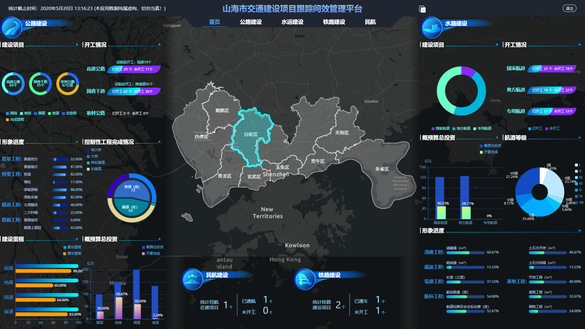
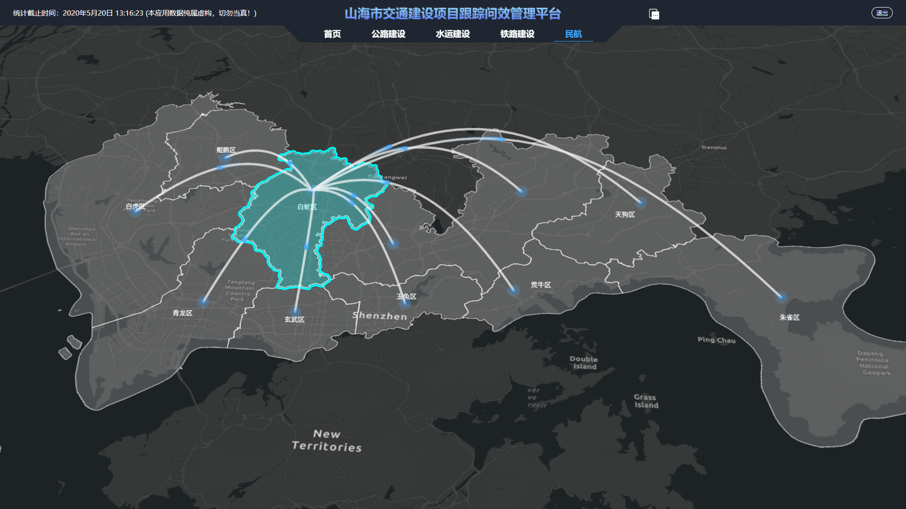
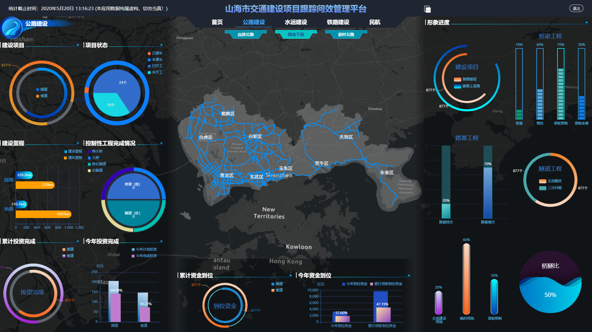
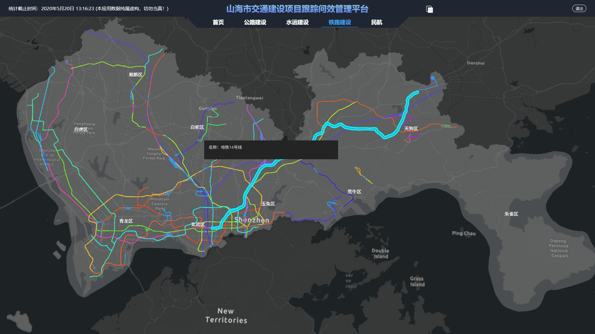

# databox
一个 gis 数据可视化示例项目  
使用 arcgis地图 + echarts图表的炫酷展示页面  
该类项目常见于中国政府智慧城市相关应用






## Project setup

```
npm install
```

### Compiles and hot-reloads for development

```
npm run serve
```

### Compiles and minifies for production

```
npm run build
```

